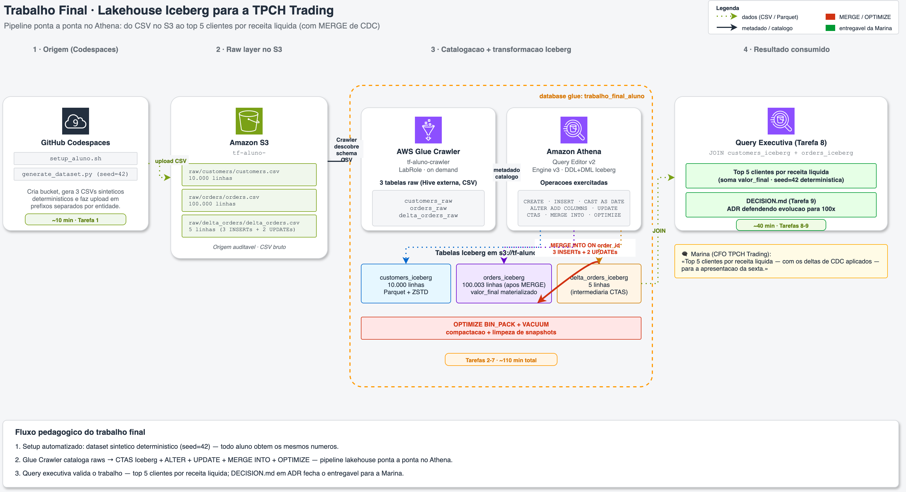
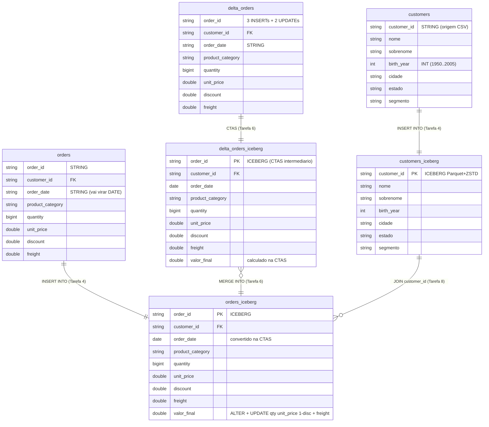
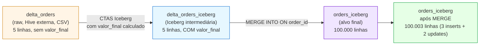

# 04 - Trabalho Final: Lakehouse Iceberg para a TPCH Trading

> **Quinta-feira, 14h. Última semana do trimestre.**
> Você é engenheiro de dados na **TPCH Trading**, distribuidora B2B com sede em São Paulo. **Marina (CFO)** te chama no Slack:
>
> > *— "Preciso fechar a apresentação para o conselho na sexta. Quero **top 5 clientes por receita líquida** com nome, cidade e segmento. Mas tem um detalhe: o time comercial fechou ajustes de última hora ontem à noite — 3 pedidos novos e 2 com desconto corrigido. Preciso desses ajustes refletidos no número final."*
>
> Você tem CSVs no S3, Athena à disposição, e exatamente **um dia** para entregar uma tabela Iceberg que aceite tanto a carga inicial quanto os deltas de CDC sem reescrever o mundo a cada batch. **Esse é o trabalho final.**

Este é o **trabalho final avaliativo** da disciplina. Você vai construir, sozinho, um pipeline lakehouse ponta a ponta no Athena: provisiona o S3, gera dados sintéticos, cataloga via Glue Crawler, materializa em Iceberg, evolui o esquema, aplica delta com `MERGE INTO`, otimiza arquivos e entrega a query executiva. No final, você defende uma decisão técnica de evolução em um documento curto (estilo ADR).

> [!WARNING]
> **Pré-requisitos obrigatórios antes de começar:**
>
> - [ ] Credenciais AWS Academy atualizadas no Codespaces — ver [Preparando Credenciais](../00-create-codespaces/Inicio-de-aula.md)
> - [ ] Codespaces da disciplina aberto com terminal funcional
> - [ ] Você concluiu os Labs 02.1 e 02.2 (Iceberg básico + MERGE/OPTIMIZE) — eles são pré-requisito conceitual
> - [ ] Você consegue acessar o [console do Amazon Athena](https://us-east-1.console.aws.amazon.com/athena/home?region=us-east-1#/landing-page) e o [console do AWS Glue](https://us-east-1.console.aws.amazon.com/glue/home?region=us-east-1#/v2/data-catalog/databases)
>
> **Valide rapidamente:**
>
> ```bash
> aws sts get-caller-identity
> ```
>
> Se retornar JSON com `Account` e `Arn`, você está pronto. Anote o `Account` (12 dígitos) — você vai usar nos SQLs.
>
> **Tempo estimado total: 3h–4h** (execução pura ~25 min + tempo para você escrever os SQLs do zero, observar resultados, debugar e escrever o `DECISION.md` ao final).

## O que você vai fazer

Você é responsável por entregar **3 coisas** para a Marina:

1. Uma tabela Iceberg `orders_iceberg` consolidada e auditável.
2. A query executiva: top 5 clientes por receita líquida.
3. Um documento `DECISION.md` defendendo uma decisão técnica de evolução, caso a TPCH cresça 100×.

Não vamos te dar os SQLs prontos. **Você escreve o pipeline inteiro**, usando o que aprendeu nos Labs 02.x e 03.x como referência. O gabarito existe (e o professor o usa), mas você só consulta depois de tentar.

## Arquitetura



O diagrama mostra o fluxo ponta a ponta do trabalho: (1) o **setup** roda no Codespaces e materializa 3 CSVs sintéticos no S3 com `seed=42`; (2) a **raw layer** vive em prefixos separados por entidade dentro de `tf-aluno-<ACCOUNT_ID>`; (3) o **Glue Crawler** cataloga os 3 CSVs como tabelas externas, e o **Athena** transforma esses raws em tabelas **Iceberg** (`customers_iceberg`, `orders_iceberg`, `delta_orders_iceberg`) via `CREATE TABLE` + `INSERT`/CTAS, evolui o esquema com `ALTER TABLE ADD COLUMNS`, aplica o delta de CDC via `MERGE INTO` e mantém a saúde da tabela com `OPTIMIZE` + `VACUUM`; (4) a **query executiva** faz `JOIN` entre as duas Iceberg para devolver o top 5 clientes por receita líquida, e o `DECISION.md` em ADR fecha o entregável para a Marina.

Fonte editável: [`img/arquitetura-trabalho-final.drawio`](img/arquitetura-trabalho-final.drawio).

## Principais pontos de aprendizagem

- provisionamento mínimo via shell script (S3 + dataset sintético)
- catalogação automática com **Glue Crawler** (CSV → tabela Hive externa)
- materialização Iceberg com `CREATE TABLE` + `INSERT INTO ... SELECT`
- conversão de tipo na carga (`CAST(order_date AS DATE)`)
- evolução de esquema (`ALTER TABLE ... ADD COLUMNS`) + `UPDATE` que materializa coluna calculada
- aplicação de CDC via **`MERGE INTO`** com tabela Iceberg intermediária
- manutenção de tabela Iceberg com `OPTIMIZE` (BIN_PACK) e `VACUUM`
- entrega analítica (top N) e justificativa técnica em ADR

## O que você terá ao final

Uma tabela `orders_iceberg` populada com **100.003 pedidos** (100k iniciais + 3 inseridos via MERGE), uma query que devolve os 5 maiores clientes por receita líquida, e um `DECISION.md` defendendo como você evoluiria o lakehouse se a TPCH crescesse 100×.

> [!TIP]
> Sempre que encontrar um bloco com o título **💡 Clique para entender**, abra esse trecho. Ele traz explicação detalhada do contexto e dicas de como abordar a tarefa — sem dar o SQL pronto.

## Modelo de dados final no Athena

O diagrama abaixo mostra as 6 tabelas que você vai materializar no database `trabalho_final_aluno` e como elas se relacionam ao longo das tarefas.



Como ler o diagrama:

- **Tabelas raw** (`customers`, `orders`, `delta_orders`) são criadas pelo Glue Crawler na **Tarefa 2** — apontam para os CSVs em `s3://tf-aluno-<ACCOUNT_ID>/raw/<entidade>/` e refletem o conteúdo bruto do CSV. O Crawler usa o nome da pasta-pai como nome da tabela (sem sufixo `_raw`). Tipos textuais ficam como `STRING`; `birth_year` e numéricos viram `INT`/`DOUBLE` por inferência.
- **Tabelas `*_iceberg`** são criadas via `CREATE TABLE` + `INSERT` (Tarefa 3 e 4) ou via CTAS (Tarefa 6), em formato Iceberg + Parquet + ZSTD, com `LOCATION` em `s3://tf-aluno-<ACCOUNT_ID>/iceberg/<entidade>/`.
- A coluna `valor_final` em `orders_iceberg` é adicionada via `ALTER TABLE ADD COLUMNS` (operação barata, só altera metadado) e populada via `UPDATE` na **Tarefa 5**.
- O `MERGE INTO` da **Tarefa 6** aplica os 5 deltas (3 INSERTs + 2 UPDATEs) atomicamente em `orders_iceberg`, gerando um único snapshot novo.
- Na **Tarefa 8**, o `JOIN` entre `customers_iceberg` e `orders_iceberg` produz o top 5 clientes por receita líquida — entregável final para a Marina.

## Mapa do trabalho

| Tarefa | O que você faz | Passos | Tempo |
|--------|----------------|--------|-------|
| [Tarefa 1](#tarefa-1---provisionamento-do-bucket-e-dataset) | Provisiona bucket S3 e gera os 3 CSVs | [1](#passo-1) · [2](#passo-2) · [3](#passo-3) | ~10 min |
| [Tarefa 2](#tarefa-2---catalogar-no-glue-com-crawler) | Cria database e Glue Crawler; gera 3 tabelas raw | [4](#passo-4) · [5](#passo-5) · [6](#passo-6) · [7](#passo-7) | ~15 min |
| [Tarefa 3](#tarefa-3---criar-tabelas-iceberg-vazias) | DDL Iceberg: `customers_iceberg` + `orders_iceberg` | [8](#passo-8) · [9](#passo-9) · [10](#passo-10) | ~15 min |
| [Tarefa 4](#tarefa-4---carregar-dados-iniciais) | `INSERT INTO ... SELECT` com `CAST(order_date AS DATE)` | [11](#passo-11) · [12](#passo-12) | ~15 min |
| [Tarefa 5](#tarefa-5---adicionar-coluna-calculada-valor_final) | `ALTER TABLE` + `UPDATE` materializando `valor_final` | [13](#passo-13) · [14](#passo-14) · [15](#passo-15) | ~15 min |
| [Tarefa 6](#tarefa-6---aplicar-delta-de-cdc-com-merge-into) | CTAS Iceberg do delta + `MERGE INTO` | [16](#passo-16) · [17](#passo-17) · [18](#passo-18) | ~25 min |
| [Tarefa 7](#tarefa-7---otimizar-a-tabela) | `OPTIMIZE` (BIN_PACK) + `VACUUM` | [19](#passo-19) · [20](#passo-20) · [21](#passo-21) | ~15 min |
| [Tarefa 8](#tarefa-8---entrega-da-query-executiva) | Top 5 clientes por receita líquida | [22](#passo-22) · [23](#passo-23) | ~10 min |
| [Tarefa 9](#tarefa-9---escrever-decisionmd) | Defender a evolução técnica em ADR | [24](#passo-24) | ~30 min |
| [Tarefa 10](#tarefa-10---limpeza) | Limpa S3 + Glue para preservar budget Learner Lab | [25](#passo-25) | ~5 min |

> [!TIP]
> Se travou em algum passo, clique no número correspondente acima.

---

<details>
<summary><b>💡 O que é um Lakehouse Iceberg em 3 parágrafos</b></summary>
<blockquote>

**Data lake puro** = arquivos Parquet/CSV no S3, catalogados como tabela Hive externa. Funciona para `SELECT` e `INSERT`, mas não tem `UPDATE`, `DELETE`, time travel ou evolução de esquema sem reescrever a tabela inteira. Era o que a TPCH tinha antes deste projeto.

**Lakehouse com Iceberg** = mesmo armazenamento (S3 + Parquet), mas com **camada de metadados transacional** que rastreia snapshots, manifests e deletes. Cada `INSERT` / `UPDATE` / `MERGE` gera um snapshot novo; o anterior fica consultável via time travel. `OPTIMIZE` reorganiza arquivos sem alterar dados de negócio. Iceberg é open-source e suportado nativamente pelo Athena.

**Por que isso importa para a Marina** — o pedido dela ("aplicar 5 deltas e ver o resultado consolidado") é trivial em DW tradicional (uma `MERGE` no Redshift) e impossível em data lake puro. Iceberg traz a transacionalidade do DW para o S3, com custo de storage do lake. Esse é o ponto da disciplina inteira.

Documentação oficial:
- [Apache Iceberg specification](https://iceberg.apache.org/spec/)
- [Querying Iceberg tables in Athena](https://docs.aws.amazon.com/athena/latest/ug/querying-iceberg.html)
- [MERGE INTO no Athena](https://docs.aws.amazon.com/athena/latest/ug/merge-into-statement.html)

</blockquote>
</details>

## Contexto

A **TPCH Trading** consolidou os pedidos do ano em um CSV no S3 e está prestes a virar a chave do data lake atual (Hive table) para um lakehouse Iceberg. A Marina precisa, na sexta, que o relatório executivo (top 5 clientes) reflita os ajustes de CDC do dia anterior. Você tem hoje (quinta) para entregar uma tabela Iceberg que:

1. Carregue os 100k pedidos do CSV principal (`orders.csv`).
2. Tenha uma coluna calculada `valor_final = quantity * unit_price * (1 - discount) + freight`.
3. Aceite um delta diário de CDC sem reescrever a tabela inteira.
4. Possa ser auditada (snapshots) e otimizada (compactação).

O dataset é sintético, gerado com seed fixa: **todo aluno obtém os mesmos números**. Compare seu top 5 com o de um colega — se diferir, alguém errou a carga.

---

## Tarefa 1 - Provisionamento do bucket e dataset

### Resultado esperado desta tarefa

Um bucket `s3://tf-aluno-<ACCOUNT_ID>/` com 3 CSVs em prefixos separados:

- `s3://tf-aluno-<ACCOUNT_ID>/raw/customers/customers.csv` (10.000 linhas)
- `s3://tf-aluno-<ACCOUNT_ID>/raw/orders/orders.csv` (100.000 linhas)
- `s3://tf-aluno-<ACCOUNT_ID>/raw/delta_orders/delta_orders.csv` (5 linhas)

---

<a id="passo-1"></a>

**1.** No Codespaces da disciplina, abra um terminal integrado e vá para a pasta do trabalho final:

```bash
cd /workspaces/FIAP-Data-Warehouse-Lakehouse-e-Data-Mesh/04-Trabalho-Final
```

<a id="passo-2"></a>

**2.** Rode o setup. Ele detecta seu account ID, cria o bucket `tf-aluno-<ACCOUNT_ID>`, gera os 3 CSVs (deterministicamente, seed=42) e faz upload em prefixos separados:

```bash
bash scripts/setup_aluno.sh
```

Saída esperada (resumo dos últimos passos):

```
[100%] Concluido com sucesso.
  Account ID: 123456789012
  Bucket:     s3://tf-aluno-123456789012
  Prefixos com dados (1 CSV por entidade - padrao do Glue Crawler):
    s3://tf-aluno-123456789012/raw/customers/
    s3://tf-aluno-123456789012/raw/orders/
    s3://tf-aluno-123456789012/raw/delta_orders/
```

<details>
<summary><b>💡 Clique para entender: por que prefixos separados por entidade?</b></summary>
<blockquote>

O **Glue Crawler** (Tarefa 2) usa o caminho do prefixo como heurística para decidir se dois objetos são "a mesma tabela" ou "tabelas diferentes". Se você jogar `customers.csv` e `orders.csv` no mesmo prefixo, ele cria UMA tabela com schema misturado (e quebra). Por isso o `setup_aluno.sh` força:

```
raw/customers/customers.csv
raw/orders/orders.csv
raw/delta_orders/delta_orders.csv
```

Cada subpasta = uma tabela no catálogo. Esse é o padrão clássico de organização de bucket para Glue Crawler.

</blockquote>
</details>

<a id="passo-3"></a>

**3.** Confirme que os 3 objetos existem no S3:

```bash
aws s3 ls s3://tf-aluno-$(aws sts get-caller-identity --query Account --output text)/raw/ --recursive
```

Saída esperada (3 linhas, com `customers.csv`, `orders.csv`, `delta_orders.csv`).

<details>
<summary><b>⚠ Se der erro: <code>Unable to locate credentials</code></b></summary>
<blockquote>

Suas credenciais AWS Academy expiraram (validade ~4h por sessão). No Learner Lab, clique em **AWS Details** → copie o bloco `[default]` para `~/.aws/credentials` e rode novamente. Confirme com `aws sts get-caller-identity`.

</blockquote>
</details>

### Checkpoint

- [ ] Bucket `tf-aluno-<ACCOUNT_ID>` criado
- [ ] 3 CSVs no S3, em prefixos separados sob `raw/`
- [ ] `aws s3 ls` mostra os 3 arquivos com tamanhos > 0

---

## Tarefa 2 - Catalogar no Glue com Crawler

### Resultado esperado desta tarefa

Um **database Glue** chamado `trabalho_final_aluno` com **3 tabelas raw** (Hive external) catalogadas: `customers`, `orders`, `delta_orders`. Cada uma aponta para o CSV correspondente em `s3://tf-aluno-<ACCOUNT_ID>/raw/<entidade>/`.

> [!IMPORTANT]
> O crawler vai varrer `s3://.../raw/` inteiro. Como o `setup_aluno.sh` colocou 3 entidades em subpastas separadas, o crawler **cria 3 tabelas** — uma por entidade, **com o nome da pasta-pai** (sem sufixo `_raw`). Confirme isso ao final desta tarefa.

---

<a id="passo-4"></a>

**4.** Antes de criar o crawler, descubra seu **account ID** uma única vez (você vai reutilizar nas próximas tarefas):

```bash
aws sts get-caller-identity --query Account --output text
```

A saída são 12 dígitos. **Anote esse valor** — toda vez que um SQL do trabalho mencionar `<ACCOUNT_ID>`, você substitui pelo seu. Alternativa: o nome do bucket que você criou no passo 2 já carrega esse valor (`tf-aluno-XXXXXXXXXXXX`):

```bash
aws s3 ls | grep tf-aluno
```

<details>
<summary><b>💡 Clique para entender: por que substituir manualmente o ACCOUNT_ID?</b></summary>
<blockquote>

Athena não tem variáveis em SQL como `\set` no psql. Cada `LOCATION 's3://...'` precisa do bucket literal. Como cada aluno tem um account ID diferente, o jeito mais simples é descobrir uma vez e substituir nos 6-7 SQLs. Se você usa VS Code, "Find & Replace" no painel do Athena resolve em 1 segundo.

</blockquote>
</details>

<a id="passo-5"></a>

**5.** Acesse o [console do AWS Glue](https://us-east-1.console.aws.amazon.com/glue/home?region=us-east-1#/v2/data-catalog/databases) → **Databases** → **Add database** → nome: `trabalho_final_aluno`.

<a id="passo-6"></a>

**6.** Vá em **Crawlers** → **Create crawler**:

- **Name**: `tf-aluno-crawler`
- **Data source**: S3 path = `s3://tf-aluno-<ACCOUNT_ID>/raw/` (substitua o seu)
- **IAM role**: `LabRole`
- **Target database**: `trabalho_final_aluno`
- **Schedule**: On demand
- **Crawler output**: deixe o default (não habilite "Update all new and existing partitions...")

Clique em **Run crawler** e aguarde ~1-2 minutos até o status mudar para `Ready`.

<details>
<summary><b>⚠ Se der erro: o crawler termina mas não cria tabelas</b></summary>
<blockquote>

Causa típica: você apontou o S3 path para `s3://tf-aluno-<ACCOUNT_ID>/` (raiz do bucket) em vez de `s3://tf-aluno-<ACCOUNT_ID>/raw/`. Edite o crawler, ajuste o path para `raw/` e rode de novo.

Outra causa: o nome do bucket no path está errado (typo no account ID). Confira com `aws s3 ls | grep tf-aluno`.

</blockquote>
</details>

<a id="passo-7"></a>

**7.** No console Glue, abra **Databases** → `trabalho_final_aluno` → **Tables**. Você deve ver **3 tabelas**:

| Tabela | Aponta para |
|--------|-------------|
| `customers` | `s3://tf-aluno-<ACCOUNT_ID>/raw/customers/` |
| `orders` | `s3://tf-aluno-<ACCOUNT_ID>/raw/orders/` |
| `delta_orders` | `s3://tf-aluno-<ACCOUNT_ID>/raw/delta_orders/` |

Clique em `orders` e confira o schema: `order_date` deve estar como **`string`** (o Crawler infere CSV como string por padrão — vamos converter para `DATE` na Tarefa 4). Em `customers`, confirme que `birth_year` foi detectado como `int` (a primeira coluna numérica do CSV é o que faz o Crawler reconhecer header automaticamente, sem classifier customizado).

### Checkpoint

- [ ] Database `trabalho_final_aluno` existe no Glue
- [ ] 3 tabelas raw catalogadas (`customers`, `orders`, `delta_orders`)
- [ ] `orders.order_date` está como `string`
- [ ] `customers.birth_year` está como `int` (header detectado)

---

## Tarefa 3 - Criar tabelas Iceberg vazias

### Resultado esperado desta tarefa

Duas tabelas Iceberg **vazias** no database `trabalho_final_aluno`:

- `customers_iceberg` — schema final dos clientes
- `orders_iceberg` — schema dos pedidos, **com `order_date` já como `DATE`** (vamos converter na carga)

A `LOCATION` de cada tabela aponta para `s3://tf-aluno-<ACCOUNT_ID>/iceberg/<entidade>/`.

---

<a id="passo-8"></a>

**8.** No [console do Athena](https://us-east-1.console.aws.amazon.com/athena/home?region=us-east-1#/landing-page), clique em **Editor de consultas**, selecione o database `trabalho_final_aluno` no painel esquerdo e configure o **Resultado da consulta** para `s3://tf-aluno-<ACCOUNT_ID>/athena-results/` (substitua seu account ID).

<details>
<summary><b>💡 Para usuários avançados: rodar SQLs via terminal em vez do console</b></summary>
<blockquote>

Se você prefere automatizar (debug iterativo, comparação entre execuções), use o script `scripts/run_athena_sql.sh` deste repo. Ele lê um `.sql`, substitui `<ACCOUNT_ID>` automaticamente, quebra em statements e roda um por um, com polling de status. Salve seu SQL em qualquer caminho (ex: `~/meus_sqls/01_create.sql`) e rode:

```bash
cd /workspaces/FIAP-Data-Warehouse-Lakehouse-e-Data-Mesh/04-Trabalho-Final && \
  bash scripts/run_athena_sql.sh ~/meus_sqls/01_create.sql
```

Saída: cada statement reporta `start → SUCCEEDED em Xs` (ou `FAILED` com motivo).

Para o trabalho avaliativo, o caminho oficial continua sendo escrever os SQLs do zero no console — o script é apenas para acelerar iterações.

</blockquote>
</details>

<a id="passo-9"></a>

**9.** Crie a tabela `customers_iceberg`. Dica: use `CREATE TABLE` (sem `EXTERNAL`) com `TBLPROPERTIES ('table_type'='iceberg', ...)`. Schema:

| Coluna | Tipo |
|--------|------|
| customer_id | STRING |
| nome | STRING |
| sobrenome | STRING |
| birth_year | INT |
| cidade | STRING |
| estado | STRING |
| segmento | STRING |

LOCATION: `s3://tf-aluno-<ACCOUNT_ID>/iceberg/customers/`

<details>
<summary><b>💡 Clique para entender: padrão de criação de tabela Iceberg no Athena</b></summary>
<blockquote>

A sintaxe é a do Lab 02.1 / 02.2:

```sql
CREATE TABLE <db>.<tabela> (
    col1 TIPO,
    col2 TIPO,
    ...
)
LOCATION 's3://...'
TBLPROPERTIES (
  'table_type'='iceberg',
  'format'='PARQUET',
  'write_compression'='zstd'
);
```

Sem `EXTERNAL`, sem `STORED AS`. O `table_type='iceberg'` é o que faz o Athena tratar a tabela como Iceberg em vez de Hive externa.

</blockquote>
</details>

<a id="passo-10"></a>

**10.** Crie a tabela `orders_iceberg` com o schema abaixo. **Atenção**: `order_date` é **`DATE`** aqui (não `STRING` como na raw — vamos fazer o `CAST` na carga):

| Coluna | Tipo |
|--------|------|
| order_id | STRING |
| customer_id | STRING |
| order_date | **DATE** |
| product_category | STRING |
| quantity | INT |
| unit_price | DOUBLE |
| discount | DOUBLE |
| freight | DOUBLE |

LOCATION: `s3://tf-aluno-<ACCOUNT_ID>/iceberg/orders/`

<details>
<summary><b>⚠ Se der erro: <code>HIVE_TABLE_BAD_DATA</code> ou semelhante</b></summary>
<blockquote>

Se rodar `SELECT * FROM orders_iceberg` agora, deve retornar 0 linhas (a tabela foi criada vazia). Se aparecer erro de schema, releia o DDL — provavelmente um tipo está com nome errado (`STRING` é STRING, não `VARCHAR`).

</blockquote>
</details>

### Checkpoint

- [ ] `SHOW TABLES IN trabalho_final_aluno;` lista as 2 tabelas Iceberg + as 3 raw (5 no total)
- [ ] `DESCRIBE orders_iceberg` mostra `order_date date` (não `string`)
- [ ] `SELECT COUNT(*) FROM orders_iceberg` retorna `0`

---

## Tarefa 4 - Carregar dados iniciais

### Resultado esperado desta tarefa

`customers_iceberg` com **10.000 linhas**; `orders_iceberg` com **100.000 linhas** e `order_date` populada como `DATE`.

---

<a id="passo-11"></a>

**11.** Carregue `customers_iceberg` a partir de `customers` (a tabela raw) com um `INSERT INTO ... SELECT`. Liste as colunas explicitamente — incluindo `birth_year` — para deixar o contrato visível.

Valide o resultado:

```sql
SELECT COUNT(*) FROM trabalho_final_aluno.customers_iceberg;
-- esperado: 10000
```

<a id="passo-12"></a>

**12.** Carregue `orders_iceberg` a partir de `orders` (a tabela raw). Aqui mora a **conversão de tipo crítica**: o crawler inferiu `order_date` como `STRING` (formato `YYYY-MM-DD`), mas a Iceberg está esperando `DATE`. Use:

```sql
... CAST(order_date AS DATE) AS order_date ...
```

no `SELECT`.

<details>
<summary><b>💡 Clique para entender: por que o CAST acontece na carga e não no Crawler</b></summary>
<blockquote>

Glue Crawler infere tipos a partir do conteúdo do CSV — e CSV é "tudo string". Mesmo que o conteúdo seja `2024-12-31`, o crawler classifica como `string`. Você poderia editar o schema da raw manualmente, mas perderia idempotência (re-rodar o crawler sobrescreve sua edição).

A prática canônica é: **deixar a raw como espelho fiel do CSV** (tudo `string` quando vem de CSV) e converter tipos **na CTAS / INSERT** para a tabela Iceberg. Esse é o padrão "schema-on-read" + "schema-on-write" do lakehouse.

A vantagem secundária: se amanhã o CSV vier com `order_date` em formato diferente (`DD/MM/YYYY`), você ajusta o `CAST` em UM lugar (a query de carga) sem reprocessar a raw.

</blockquote>
</details>

Valide o resultado:

```sql
SELECT
    COUNT(*)                  AS total,
    MIN(order_date)           AS data_min,
    MAX(order_date)           AS data_max,
    COUNT(DISTINCT customer_id) AS clientes_distintos
FROM trabalho_final_aluno.orders_iceberg;
-- esperado: total=100000, data_min=2023-01-01, data_max=2024-12-31
```

> [!IMPORTANT]
> Se `data_min` ou `data_max` aparecer como `null` ou string, o `CAST` falhou em alguma linha (formato inesperado). Investigue com `SELECT order_date FROM orders WHERE order_date NOT LIKE '____-__-__' LIMIT 5;`.

### Checkpoint

- [ ] `customers_iceberg` tem 10.000 linhas
- [ ] `orders_iceberg` tem 100.000 linhas
- [ ] `data_min = 2023-01-01` e `data_max = 2024-12-31`
- [ ] Snapshots criados — confirme com `SELECT * FROM "trabalho_final_aluno"."orders_iceberg$snapshots"`

---

## Tarefa 5 - Adicionar coluna calculada `valor_final`

### Resultado esperado desta tarefa

Coluna `valor_final DOUBLE` adicionada em `orders_iceberg`, populada em todas as 100.000 linhas com a fórmula:

```
valor_final = quantity * unit_price * (1 - discount) + freight
```

---

<a id="passo-13"></a>

**13.** Use `ALTER TABLE ... ADD COLUMNS (valor_final DOUBLE)` para adicionar a coluna no schema. Esta operação é **barata em Iceberg** — só altera metadado, não reescreve arquivos de dados.

<details>
<summary><b>💡 Clique para entender: ALTER TABLE em Iceberg é metadado</b></summary>
<blockquote>

Em Hive externa (data lake puro), adicionar coluna exige reescrever a tabela inteira (ou conviver com `null` em todas as linhas existentes para sempre, sem voltar atrás). Em Iceberg, o schema é versionado no metadado: o `ALTER` cria uma nova versão do schema, e linhas antigas continuam no Parquet original — quando lidas, são "preenchidas" com `null` na coluna nova até serem regravadas.

Por isso o `ALTER` roda em ~5 segundos. Já o `UPDATE` do passo 14 é o que demora — ele varre os 100k registros e regrava arquivos com a coluna materializada.

</blockquote>
</details>

<a id="passo-14"></a>

**14.** Rode um `UPDATE` que materializa `valor_final` em todas as linhas. Tempo esperado no Athena: **30–60 segundos**.

<a id="passo-15"></a>

**15.** Valide:

```sql
SELECT
    COUNT(*)                       AS total,
    COUNT(valor_final)             AS com_valor,
    ROUND(MIN(valor_final), 2)     AS min_valor,
    ROUND(MAX(valor_final), 2)     AS max_valor,
    ROUND(AVG(valor_final), 2)     AS media_valor
FROM trabalho_final_aluno.orders_iceberg;
-- esperado: total=100000, com_valor=100000 (zero NULLs)
-- min_valor > 0, max_valor < 15000 (ordem de grandeza)
```

### Checkpoint

- [ ] `valor_final` existe no schema (confirme com `DESCRIBE orders_iceberg`)
- [ ] `com_valor = total = 100000` (nenhum NULL)
- [ ] `min_valor > 0`

---

## Tarefa 6 - Aplicar delta de CDC com `MERGE INTO`

### Resultado esperado desta tarefa

A tabela `orders_iceberg` passa a ter **100.003 linhas** (3 inserts do delta + 100k - 0 deletes), e os 2 pedidos do delta com `operation = update` têm `discount` e `valor_final` atualizados.

> [!IMPORTANT]
> Esta é a tarefa-âncora do trabalho. Marina te entregou 5 deltas (3 INSERTs + 2 UPDATEs) e quer ver o número final consolidado. Você vai aplicar os 5 em **um único MERGE transacional**.

### Estratégia

A fonte do `MERGE` precisa ter **a mesma estrutura da tabela alvo** — incluindo `valor_final` calculado. Como `delta_orders` (raw Hive externa, vinda do crawler) só tem as 8 colunas do CSV (sem `valor_final`), você precisa de uma **tabela intermediária Iceberg** que já materialize `valor_final` para cada delta.



---

<a id="passo-16"></a>

**16.** Crie a tabela intermediária `delta_orders_iceberg` via `CREATE TABLE ... AS SELECT` (CTAS) lendo de `delta_orders` (a tabela raw). Aplique no `SELECT`:

- `CAST(order_date AS DATE)` (mesmo motivo da Tarefa 4)
- `quantity * unit_price * (1 - discount) + freight AS valor_final`

LOCATION: `s3://tf-aluno-<ACCOUNT_ID>/iceberg/delta_orders/`

Propriedades do CTAS Iceberg (cláusula `WITH (...)`): `table_type='ICEBERG'`, `format='PARQUET'`, `write_compression='ZSTD'`, **`is_external=false`** (obrigatório para CTAS Iceberg — ver troubleshoot abaixo) e `location='s3://.../iceberg/delta_orders/'`.

<details>
<summary><b>⚠ Se der erro: <code>Only managed table is supported for Iceberg table type</code></b></summary>
<blockquote>

Causa: o Athena exige que tabelas Iceberg sejam **managed** (gerenciadas pelo próprio engine), não external. No CTAS isso é controlado pelo parâmetro `is_external`.

Solução: adicione `is_external = false` dentro do bloco `WITH (...)`, ao lado de `table_type='ICEBERG'`. Exemplo:

```sql
CREATE TABLE trabalho_final_aluno.delta_orders_iceberg
WITH (
    table_type        = 'ICEBERG',
    format            = 'PARQUET',
    write_compression = 'ZSTD',
    is_external       = false,
    location          = 's3://tf-aluno-<ACCOUNT_ID>/iceberg/delta_orders/'
) AS
SELECT ...
```

Sem `is_external = false`, o Athena tenta criar tabela Hive externa e o `table_type='ICEBERG'` é rejeitado. Esse parâmetro só aparece em CTAS — no `CREATE TABLE` "vazio" da Tarefa 3 a tabela já é managed por default quando se usa `TBLPROPERTIES`.

</blockquote>
</details>

Valide:

```sql
SELECT * FROM trabalho_final_aluno.delta_orders_iceberg ORDER BY order_id;
-- esperado: 5 linhas
-- 3 com order_id = O100001/O100002/O100003 (inserts novos)
-- 2 com order_id = O000001/O000002 (updates dos primeiros pedidos, discount = 0.50 / 0.45)
```

<a id="passo-17"></a>

**17.** Aplique o `MERGE INTO`. Chave: `order_id`. Comportamento:

- `WHEN MATCHED` → `UPDATE SET` todas as colunas de negócio (incluindo `valor_final`)
- `WHEN NOT MATCHED` → `INSERT` com todas as colunas, incluindo `valor_final`

Tempo esperado: **10–30 segundos**.

<details>
<summary><b>💡 Clique para entender: por que CTAS Iceberg em vez de external table direta?</b></summary>
<blockquote>

Você poderia tentar fazer `MERGE INTO orders_iceberg USING delta_orders ...` direto (lendo a raw). Funcionaria *parcialmente* — mas teria 2 problemas:

1. **`valor_final` não está na raw.** Você teria que calcular dentro do `USING (SELECT ..., quantity*unit_price*... AS valor_final FROM delta_orders)`, deixando a regra de negócio espalhada (ela já mora no UPDATE da Tarefa 5; agora moraria *também* no MERGE).
2. **`order_date` na raw é STRING.** Você teria que fazer `CAST` no `USING`, dobrando o número de lugares onde a conversão acontece.

A CTAS intermediária resolve os 2: regra de negócio fica num lugar só (a CTAS), e a fonte do MERGE tem schema idêntico à alvo. Bônus: a `delta_orders_iceberg` fica auditável — você pode revisitar exatamente o delta aplicado depois.

</blockquote>
</details>

<a id="passo-18"></a>

**18.** Valide o resultado:

```sql
-- 1) total deve ser 100.003 (100k + 3 inserts)
SELECT COUNT(*) FROM trabalho_final_aluno.orders_iceberg;

-- 2) os 2 updates devem ter discount = 0.50 / 0.45
SELECT t.order_id, t.discount, t.valor_final
FROM trabalho_final_aluno.orders_iceberg t
JOIN trabalho_final_aluno.delta_orders_iceberg s
  ON t.order_id = s.order_id
ORDER BY t.order_id;
-- esperado: 5 linhas, valor_final batendo com s.valor_final

-- 3) o snapshot do MERGE aparece com operation = overwrite
SELECT snapshot_id, operation, summary
FROM "trabalho_final_aluno"."orders_iceberg$snapshots"
ORDER BY committed_at DESC
LIMIT 5;
```

### Checkpoint

- [ ] `orders_iceberg` tem 100.003 linhas
- [ ] Os 2 order_ids do delta-update têm `discount` atualizado e `valor_final` recalculado
- [ ] Snapshot novo com `operation = overwrite` aparece em `$snapshots`

---

## Tarefa 7 - Otimizar a tabela

### Resultado esperado desta tarefa

A tabela `orders_iceberg` é compactada (BIN_PACK) e o número de arquivos físicos cai significativamente. Snapshots históricos seguem consultáveis.

---

<a id="passo-19"></a>

**19.** Foto **antes** do OPTIMIZE — anote o número de arquivos:

```sql
SELECT COUNT(*) AS num_arquivos_antes
FROM "trabalho_final_aluno"."orders_iceberg$files";
```

<a id="passo-20"></a>

**20.** Rode o OPTIMIZE com estratégia BIN_PACK (default — agrupa arquivos pequenos em arquivos maiores até ~512 MB) e em seguida o VACUUM (limpa snapshots órfãos além do retention default):

```sql
OPTIMIZE trabalho_final_aluno.orders_iceberg REWRITE DATA USING BIN_PACK;
```

Em uma **query separada** (VACUUM não pode rodar em transação composta):

```sql
VACUUM trabalho_final_aluno.orders_iceberg;
```

<details>
<summary><b>⚠ Se der erro: <code>VACUUM cannot run inside a multiple commands statement</code></b></summary>
<blockquote>

Você executou `OPTIMIZE` e `VACUUM` no mesmo painel SQL (Athena considera isso um statement múltiplo). Quebre em 2 queries separadas. Mesmo padrão do Lab 02.2.

</blockquote>
</details>

<a id="passo-21"></a>

**21.** Foto **depois** do OPTIMIZE:

```sql
SELECT COUNT(*) AS num_arquivos_depois
FROM "trabalho_final_aluno"."orders_iceberg$files";

-- Snapshot novo com operation = replace
SELECT snapshot_id, operation, summary
FROM "trabalho_final_aluno"."orders_iceberg$snapshots"
ORDER BY committed_at DESC
LIMIT 5;
```

Espera-se: `num_arquivos_depois < num_arquivos_antes` (geralmente 1-3 arquivos), e um snapshot novo com `operation = replace`.

### Checkpoint

- [ ] Número de arquivos caiu (geralmente 1-3 arquivos depois)
- [ ] Snapshot com `operation = replace` aparece
- [ ] `SELECT COUNT(*)` continua retornando **100.003** (dados intactos)

---

## Tarefa 8 - Entrega da query executiva

### Resultado esperado desta tarefa

Uma query que devolve **5 linhas** com top 5 clientes por receita líquida total. Esse é o entregável simbólico para a Marina.

---

<a id="passo-22"></a>

**22.** Escreva a query: top 5 clientes por `SUM(valor_final)`, com `JOIN` entre `orders_iceberg` e `customers_iceberg`. Colunas:

| Coluna | Origem |
|--------|--------|
| customer_id | customers |
| nome_completo | `nome \|\| ' ' \|\| sobrenome` |
| cidade | customers |
| estado | customers |
| segmento | customers |
| receita_total | `ROUND(SUM(valor_final), 2)` |
| qtd_pedidos | `COUNT(order_id)` |
| ticket_medio | `ROUND(AVG(valor_final), 2)` |

`ORDER BY receita_total DESC LIMIT 5`.

> [!TIP]
> Como a tabela `customers_iceberg` agora tem `birth_year`, você pode opcionalmente enriquecer a query com a idade dos clientes do top 5 (ex: `2024 - birth_year AS idade`) — útil para a Marina entender o perfil dos top compradores. Não é obrigatório, mas conta ponto de maturidade analítica.

<a id="passo-23"></a>

**23.** Anote o `customer_id` do **#1 da lista** e a `receita_total`. Compare com um colega: como o dataset é determinístico (seed=42), os 2 devem ter o **mesmo customer_id e mesmo valor**.

> [!TIP]
> Se você e um colega rodarem o trabalho corretamente, o top 5 de vocês é **idêntico até o centavo**. Se diferir, alguém errou um passo (provavelmente o `CAST` na Tarefa 4 ou o MERGE na Tarefa 6). Comparação social vira ferramenta de auto-validação.

### Checkpoint

- [ ] Query retorna 5 linhas
- [ ] `receita_total` está em ordem decrescente
- [ ] Cada linha tem `qtd_pedidos > 0` e `ticket_medio > 0`

---

## Tarefa 9 - Escrever `DECISION.md`

### Resultado esperado desta tarefa

Um arquivo `DECISION.md` (estilo ADR — Architecture Decision Record) defendendo **uma** decisão técnica de evolução do lakehouse caso a TPCH cresça 100× (de 100k para 10M pedidos).

---

<a id="passo-24"></a>

**24.** Crie um arquivo `DECISION.md` na sua pasta de entregáveis do Codespaces, com a estrutura:

```markdown
# DECISION — Como evoluir `orders_iceberg` se a TPCH crescer 100×

## Contexto
<2-3 linhas: situação atual + cenário futuro>

## O que eu mudaria primeiro
<a decisão principal: particionamento? Z-ordering? materialized view? streaming? Qual e por quê. Dê 2-3 razões objetivas.>

## Alternativas que descartei (nesta primeira iteração)
<tabela com 3-4 alternativas e por que NÃO agora>

## Como eu validaria a decisão
<2-3 queries ou métricas que você rodaria para confirmar que a escolha foi a certa>

## Pergunta para validar com o stakeholder
<1 pergunta para a Marina que ajudaria a decidir>
```

> [!IMPORTANT]
> Não tem "resposta correta única". O gabarito (que o professor usa para referência) defende particionamento por mês. Você pode defender Z-ordering, materialized view ou streaming — desde que o raciocínio seja consistente, com trade-offs explícitos. **Critério: capacidade de defender a escolha em 5 minutos numa entrevista técnica sênior.**

### Checkpoint

- [ ] `DECISION.md` existe com as 5 seções
- [ ] A decisão principal tem 2-3 razões objetivas
- [ ] Pelo menos 3 alternativas foram explicitamente descartadas
- [ ] Pergunta para o stakeholder está formulada

---

## Tarefa 10 - Limpeza

### Resultado esperado desta tarefa

Bucket S3 vazio e tabelas Glue removidas. Conta AWS limpa, Learner Lab budget preservado.

---

<a id="passo-25"></a>

**25.** Limpe os recursos. **Esta etapa é obrigatória** — esquecer de limpar consome budget do Learner Lab.

```bash
# Esvazia o bucket (necessario antes de deletar)
aws s3 rm "s3://tf-aluno-$(aws sts get-caller-identity --query Account --output text)" --recursive

# Apaga o bucket
aws s3 rb "s3://tf-aluno-$(aws sts get-caller-identity --query Account --output text)"
```

E no console Glue:

1. **Databases** → `trabalho_final_aluno` → **Action → Delete database** (apaga tabelas e database juntos).
2. **Crawlers** → `tf-aluno-crawler` → **Action → Delete**.

> [!CAUTION]
> Confirme que o bucket sumiu com `aws s3 ls | grep tf-aluno`. Se ainda aparecer, repita o `rb`. Bucket vazio também cobra (storage de logs e metadados de versionamento), então **delete tudo**, não só esvazie.

---

## Conclusão

Se você chegou até aqui, então entregou:

- **Pipeline lakehouse ponta a ponta** (CSV → Glue Catalog → Iceberg → MERGE → OPTIMIZE)
- **Tabela auditável** com 100.003 pedidos e 5 snapshots (insert customers, insert orders, alter+update valor_final, merge delta, optimize replace)
- **Query executiva** para a Marina (top 5 clientes)
- **`DECISION.md`** defendendo evolução técnica em ADR

**Mensagem para a Marina**: o pipeline está pronto, o número fechou, e dá para repetir o ciclo (delta diário) sem reescrever a tabela. Os ajustes do CDC viraram um único `MERGE`, e a manutenção mensal é um `OPTIMIZE` agendado. **TPCH Trading agora opera como lakehouse.**

---

<details>
<summary><b>💡 Glossário rápido — termos que aparecem neste trabalho</b></summary>
<blockquote>

| Termo | O que é |
|-------|---------|
| **Glue Crawler** | Serviço AWS que varre um prefixo S3, infere schema dos arquivos (CSV/Parquet) e cria tabelas no Glue Data Catalog. Padrão "schema-on-read". |
| **Tabela raw / external** | Tabela Hive externa que aponta para arquivos no S3. Sem `UPDATE`/`DELETE`/snapshots. Usada como espelho fiel do dado bruto. |
| **Iceberg** | Formato aberto de tabela com camada de metadados transacional (snapshots, manifests, deletes). Suporta `INSERT`, `UPDATE`, `DELETE`, time travel, evolução de esquema. |
| **CTAS** | `CREATE TABLE ... AS SELECT`. Cria a tabela e popula em um único comando. Padrão para tabela intermediária Iceberg. |
| **`MERGE INTO`** | Comando que combina `INSERT` + `UPDATE` (+ `DELETE`) em uma única instrução transacional. Padrão de aplicação de CDC. |
| **CDC (Change Data Capture)** | Padrão onde uma fonte gera registros marcados como insert/update/delete; o consumidor aplica via `MERGE`. |
| **OPTIMIZE BIN_PACK** | Estratégia que agrupa arquivos pequenos em arquivos maiores (~512 MB) sem alterar conteúdo. Mantém saúde da tabela ao longo do tempo. |
| **VACUUM** | Remove snapshots e arquivos órfãos além do retention configurado (default: 5 dias). Roda **fora de transação composta**. |
| **`$snapshots`** | Tabela virtual `<tabela>$snapshots` exposta pelo Iceberg para inspecionar histórico de operações. |
| **`$files`** | Tabela virtual com a lista de arquivos físicos da tabela Iceberg — útil para medir efeito do `OPTIMIZE`. |

</blockquote>
</details>

<details>
<summary><b>💡 Como pedir ajuda se travou</b></summary>
<blockquote>

Antes de abrir issue/perguntar no Slack, colete estas 4 informações:

1. **Em que passo você está** (ex: "passo 17, rodando o `MERGE INTO`")
2. **Mensagem de erro literal** (copia-cola completo do painel de query do Athena)
3. **Saída de** `SELECT operation, count(*) FROM "trabalho_final_aluno"."orders_iceberg$snapshots" GROUP BY operation;` (mostra histórico de operações)
4. **O que você já tentou**

Canais (em ordem de prioridade):

- **Issues do repositório**: [github.com/vamperst/FIAP-Data-Warehouse-Lakehouse-e-Data-Mesh/issues](https://github.com/vamperst/FIAP-Data-Warehouse-Lakehouse-e-Data-Mesh/issues)
- **E-mail do professor**: `rafael.barbosa@fiap.com.br`

</blockquote>
</details>
